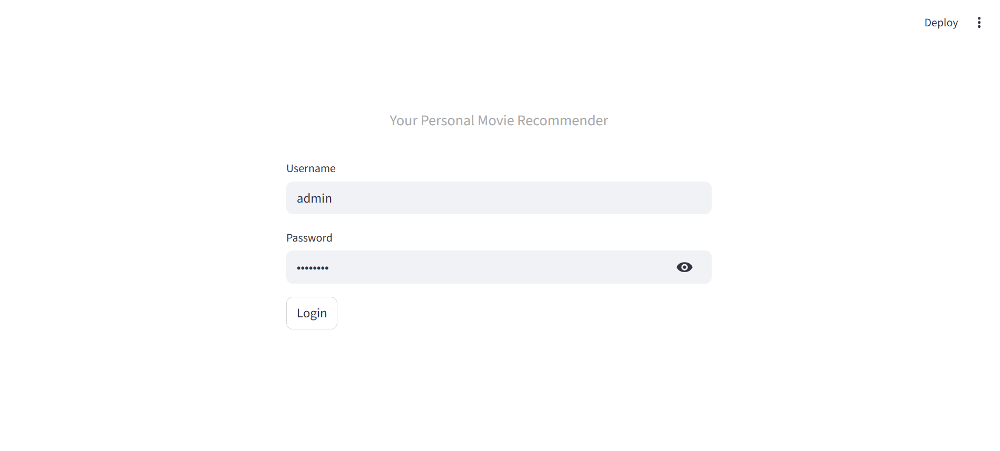
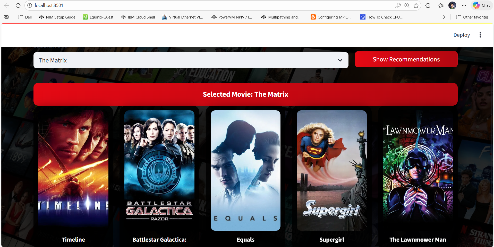

## 🎬 Movie Recommendation System | Streamlit + ML + TMDB API

A smart and interactive web application that suggests movies based on your given Query. Built with Python and Streamlit, this app uses machine learning to recommend movies similar to the one you select, complete with movie posters fetched in real-time.

 ## 🧿How It Works
 * Login: Access the app using a secure login page.
 * Select: Choose a movie you like from the dropdown menu.
 * Recommend: Click the button to see 5 similar movies.
 * Visuals: The app fetches and displays the official movie posters using the TMDB API.

## 🧿Recommendation Logic

- Uses vector similarity between movies

- Excludes the selected movie itself

- Returns the most relevant recommendations

## 🧿Key Features
 * User Authentication: specialized login page to secure the app.
 * Content-Based Filtering: Uses a pre-trained similarity model to find the best matches.
 * Live API Integration: Fetches high-quality posters dynamically from The Movie Database (TMDB).
 * Responsive UI: Custom CSS styling for a modern look, including  effects and hover animations.
 * Mobile Friendly: Layout can adaptable to different screen sizes.

## 🧿Tech Stack
 * Python (Programming language for Core Logic)
 * Streamlit (Web Interface)
 * Pandas & Pickle (Data Handling)
 * Requests (API Handling)

## 🧿Project Structure

├── app.py
├── movies_list.pkl(The list of movies)
├── similarity.pkl(The similarity matrix)
├── moviebg.jpg(Background image)
├── requirements.txt
└── README.md

### 🔐 Default Login Credentials
 * Username: admin
 * Password: Amit@ak1

🧿Demo Screenshot:

